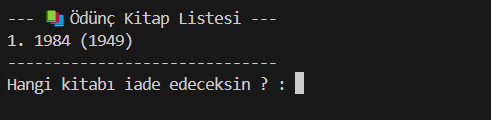

# Library Management System (C)

A complete **Library Management System** built in C language, providing both **staff** and **user** interfaces.  
The system manages books, users, lending operations, and keeps detailed return logs using file handling.

---

## Features
### User Panel
- View all available books
- Borrow books
- Return books
- View your borrowed book list

### Staff Panel
- Add new books
- Remove books
- List all books
- View all borrowed books (by all users)
- View return logs with timestamps

### General
- Simple CLI-based interface
- File handling for persistent data
- Return logs with detailed timestamps
- Basic authentication system for staff and users

---

## File Structure
- **kitap.txt** → Stores available books  
- **kullanici.txt** → Stores user login info  
- **personelkullanici.txt** → Stores staff login info  
- **bin/odunc_<username>.txt** → Stores borrowed books per user  
- **iadelog.txt** → Stores all return logs with timestamp  

---

## Screenshots

### Login Panel


### User Panel

#### Borrow a Book


#### Return a Book


### Staff Panel
#### Add / Remove Books


#### Book List


#### Borrowed Books (All Users)


#### Return Logs


---

## Usage
1. **Clone the repository:**
   ```bash
   git clone https://github.com/furkanaktrk/library-c.git
   cd library-c
2. **Compile the project:**
   gcc main.c -o library
  
3. **Run:**
   ./library
